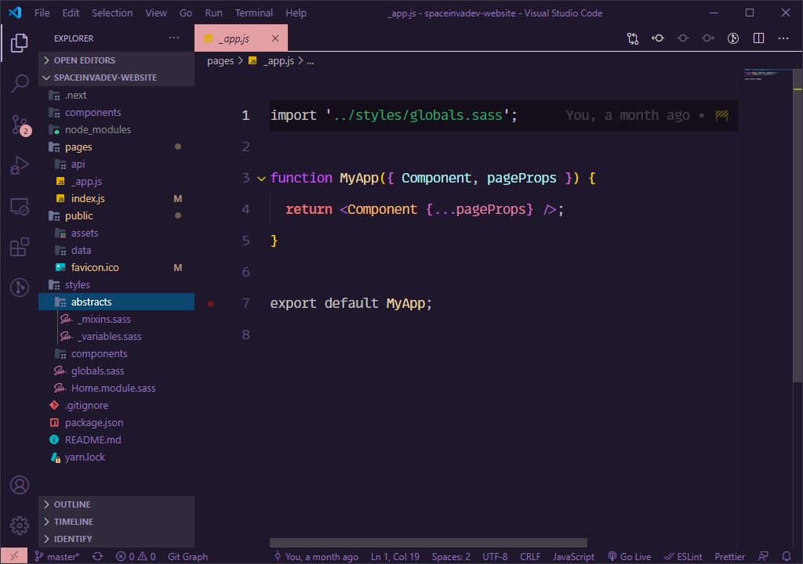
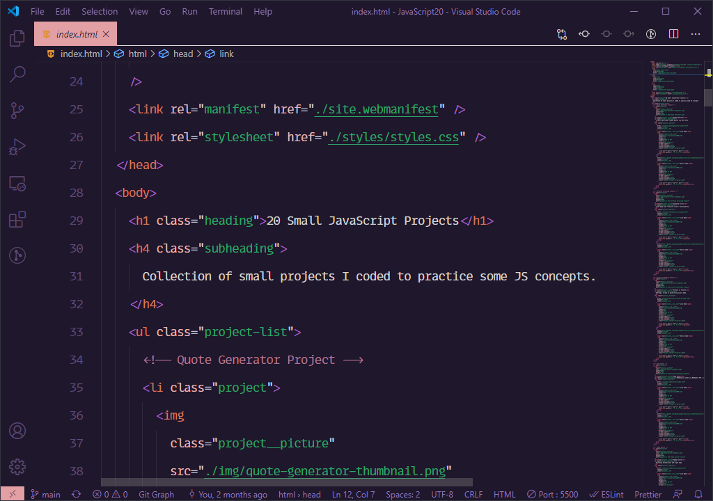
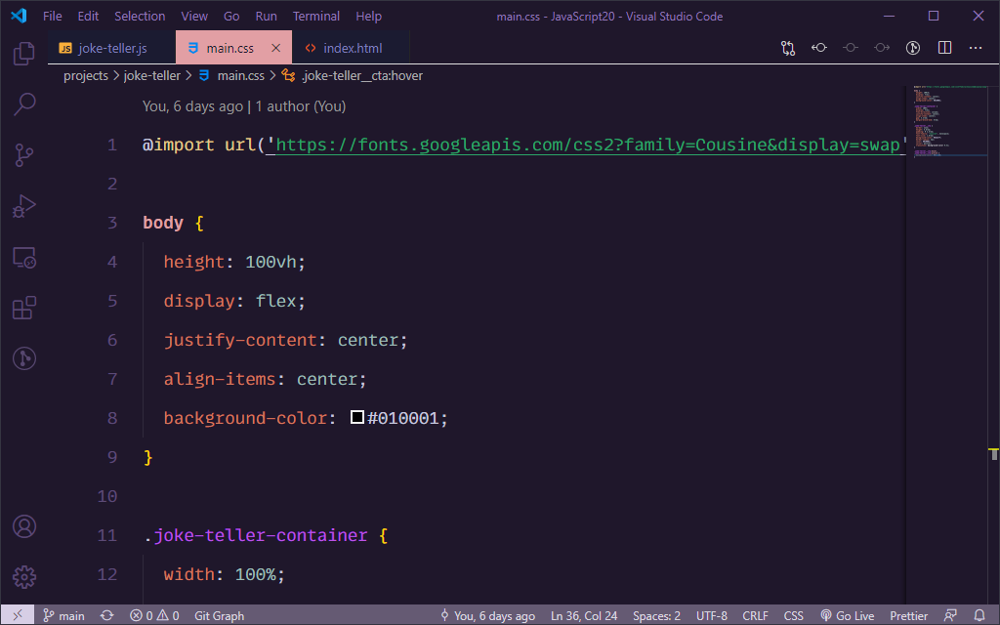
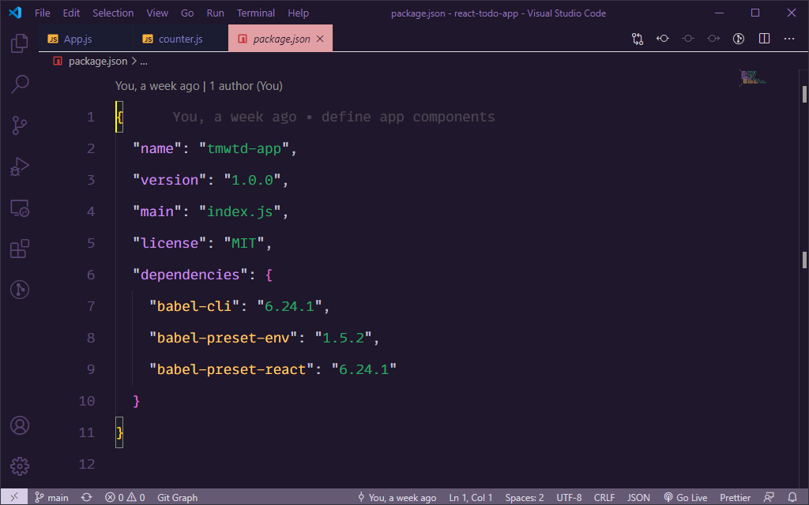

# AlterNight 🌠

A Visual Studio Code theme for those who code at night

## AlterNight



### JavaScript


### HTML



### CSS



### JSON



## Installation

1. Open the `Extensions` menu on the sidebar
2. Search for `AlterNight Theme`
3. Click `Install`
4. When prompted, select `AlterNight Theme` as Color Theme

> In case of not being prompted to select a Color Theme upon installing, go to the menu bar and select: `Code > Preferences > Color Theme > AlterNight Theme`

### Recommended settings for a better experience

The font in the preview images is **IBM Plex Mono**, which can be downloaded for free from [Google Fonts](https://fonts.google.com/). I've added some personal typography-related settings, which you can achieve by adding the following to your `settings.json` file.

```json
// Controls the font family
"editor.fontFamily": "'IBM Plex Mono', monospace",
// Controls the font size
"editor.fontSize": 16.5,
// Controls the font weight
"editor.fontWeight": "400",
// Controls the line height. If you prefer to compute the lineHeight from the fontSize, use 0
"editor.lineHeight": 38,
// Enables font ligatures
"editor.fontLigatures": true,
```

### Customize/Override theme colors

You can customize/override the AlterNight theme colors by adding the following theme-specific configuration to your settings file. For more advanced customization, refer to the corresponding [VS Code Docs](https://code.visualstudio.com/docs/getstarted/themes#_customizing-a-color-theme).

#### Example of basic customization

```json
"editor.tokenColorCustomizations": {
    "[AlterNight]": {
        "comments": "#229977"
    }
},
```

#### Example of advanced customization

```json
"editor.tokenColorCustomizations": {
    "[AlterNight YOUR_REMIX]": {
        "textMateRules": [
            {
                "scope": [
                    "punctuation.definition.comment",
                    "comment.block",
                    "comment.line",
                    "comment.block.documentation"
                ],
                "settings": {
                    "foreground": "#FFFF00"
                }
            }
        ]
    },
},

"workbench.colorCustomizations": {
	"[AlterNight YOUR_REMIX]": {
		"sideBar.background": "#FFFF00",
	}
},
```

### Contributions, Issues & Suggestions

Any feedback, suggestion, or issue reporting is welcome. Feel free to submit your concern via the [Repo's GitHub Issues](https://github.com/spaceinvadev/alternight-vscode-theme/issues) page, provide feedback or request a feature by submitting a PR.

### Changelog

All relevant changes for each version are outlined in the changelog. Consider updating and checking the changelog before filing any issues, as they may have already been addressed.
