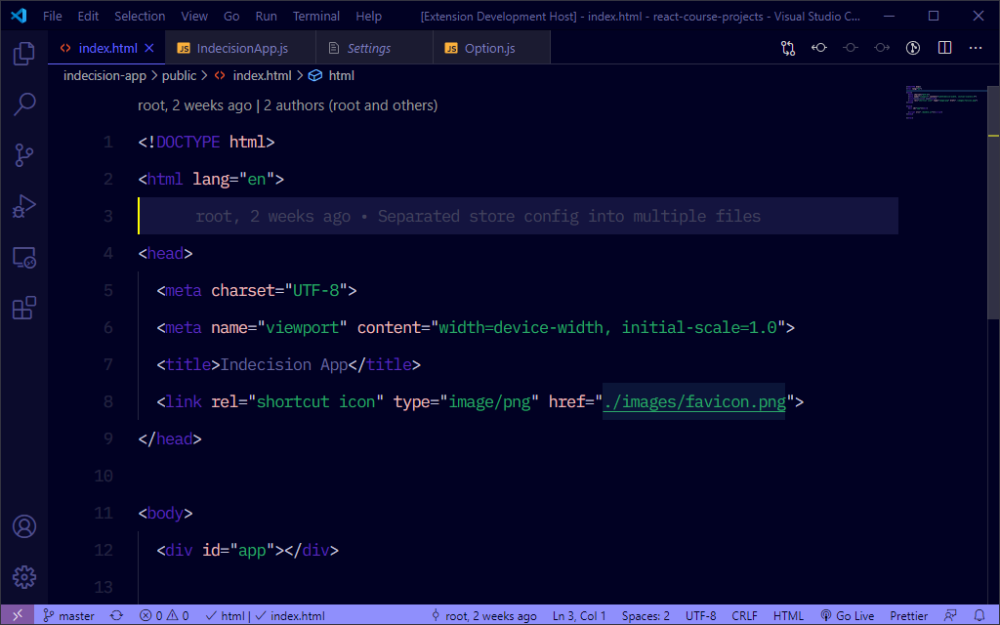
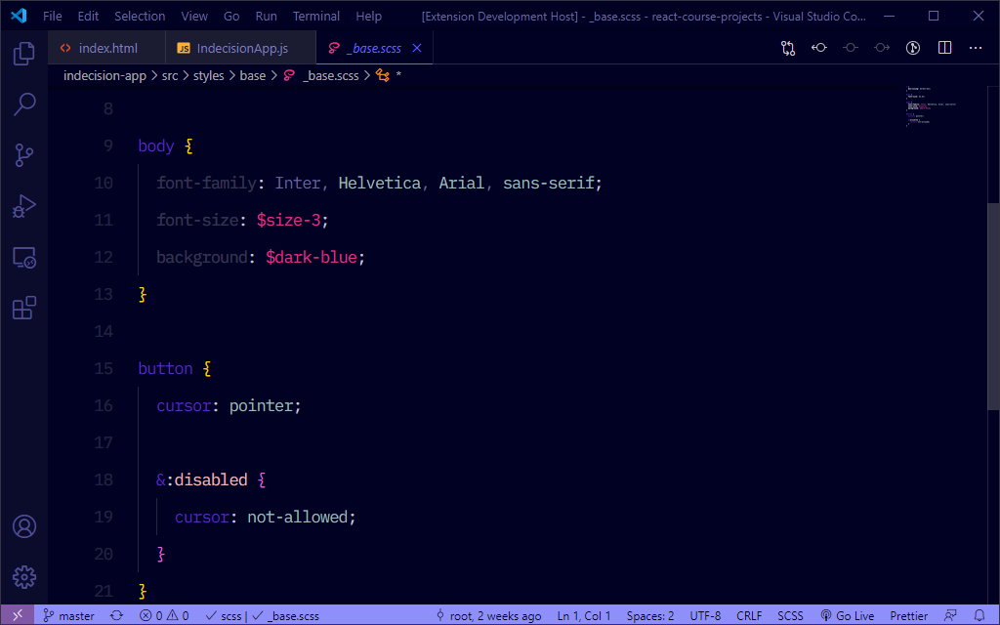
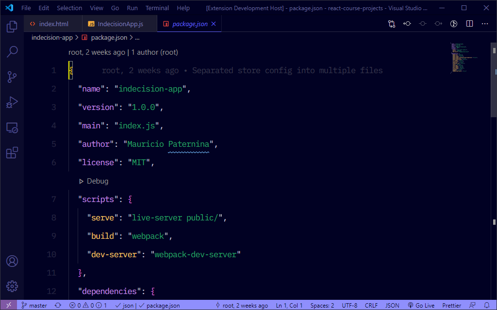

# AlterNight 🌠

[](https://aka.ms/purpura)
[](https://aka.ms/spaceinvadev)

A Visual Studio Code theme for those who code at night

## AlterNight


##### JavaScript


##### HTML



##### CSS



##### JSON



## Installation

1. Install [Visual Studio Code](https://code.visualstudio.com/)
2. Launch Visual Studio Code
3. Choose **Extensions** from side menu
4. Search for `AlterNight`
5. Click **Install**
6. When prompted, select **AlterNight** as theme

> In case of not being prompted upon installing, go to the menu bar and click: Code > Preferences > Color Theme > **AlterNight**

### Separate the Editor from the Sidebar

This theme uses contrast sparingly so that when it's applied, it's more meaningful. This can help reduce noise and improve your ability to scan. However, some of the decisions may not work for everyone. One such decision that some disagree on is whether or not to have a separation between the editor and sidebar, and the amount of contrast. If you wish for this to have more visual significance, please paste this into your user settings preferences. These are my recommendations for these settings but you can use whatever colors you wish.

### User preferences shown in the preview

The font in the preview images is **IBM Plex Mono**, which can be downloaded for free from [Google Fonts](https://fonts.google.com/). I've added some personal typography-related settings, which you can achieve by adding the following to your `settings.json` file.

```json
"editor.fontFamily": "'IBM Plex Mono', monospace",
"editor.fontSize": 16.5,
"editor.fontWeight": "400",
"editor.fontLigatures": true,
"editor.lineHeight": 38,
```

## Contribution and Changelog

This is the first theme I've ever created, so chances are that I did something wrong or I missed something. If that's the case, feel free to [file an issue](https://github.com/spaceinvadev/purpura-vscode-theme/issues), provide feedback or request a feature by submitting a PR.

All relevant changes for each version are outlined in the changelog. Consider updating and checking the changelog before filing any issues, as they may have already been addressed.
